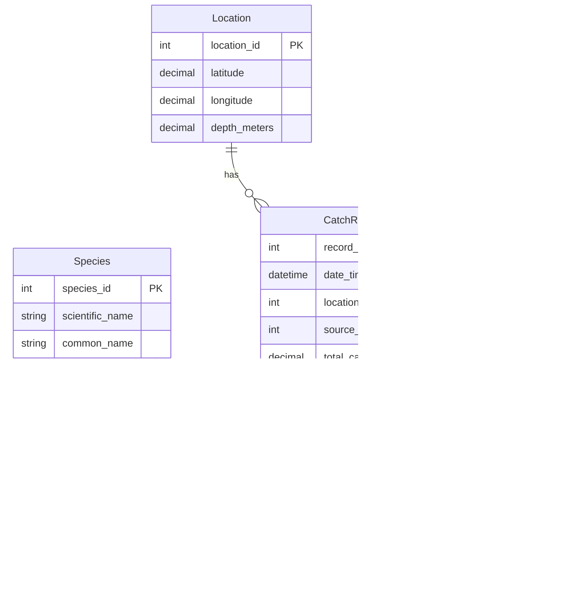

```mermaid
erDiagram
    Species ||--o{ SpeciesOccurrence : "has"
    Species ||--o{ SpeciesAbundance : "has"
    Location ||--o{ CatchRecord : "has"
    DataSource ||--o{ CatchRecord : "provides"
    CatchRecord ||--o{ SpeciesOccurrence : "contains"
    CatchRecord ||--o{ SpeciesAbundance : "contains"

    Species {
        int species_id PK
        string scientific_name
        string common_name
    }

    Location {
        int location_id PK
        decimal latitude
        decimal longitude
        decimal depth_meters
    }

    DataSource {
        int source_id PK
        string source_name
        string source_type
        string description
    }

    CatchRecord {
        int record_id PK
        datetime date_time
        int location_id FK
        int source_id FK
        decimal total_catch_weight
        string data_type
    }

    SpeciesOccurrence {
        int occurrence_id PK
        int record_id FK
        int species_id FK
    }


    SpeciesAbundance {
        int abundance_id PK
        int record_id FK
        int species_id FK
        decimal catch_weight
    }

```
