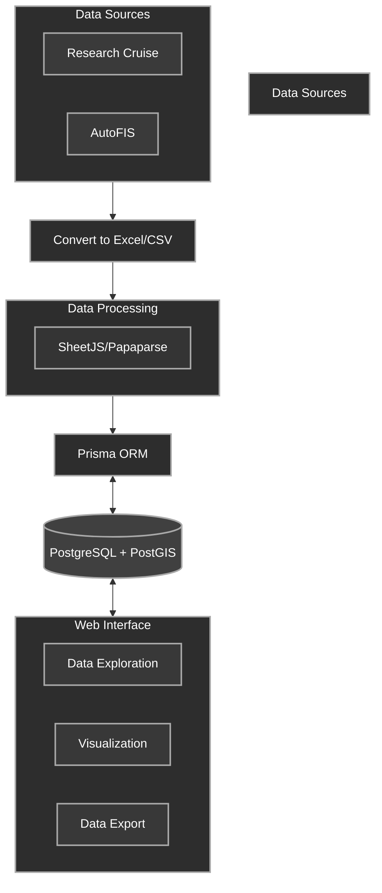

```mermaid
flowchart TD
    A[Data Sources]
    
    subgraph DataSources["Data Sources"]
        B[Research Cruise]
        C[AutoFIS]
    end
    
    D[Convert to Excel/CSV]
    
    subgraph Processing["Data Processing"]
        E[SheetJS/Papaparse]
    end
    
    G[Prisma ORM]
    
    H[(PostgreSQL + PostGIS)]
    
    subgraph WebInterface["Web Interface"]
        I[Data Exploration]
        J[Visualization]
        K[Data Export]
    end
    
    DataSources --> D
    D --> Processing
    Processing --> G
    G <--> H
    H <--> WebInterface
    
    classDef default fill:#2d2d2d,stroke:#a9a9a9,stroke-width:2px,color:#fff;
    classDef sources fill:#3a3a3a,stroke:#a9a9a9,stroke-width:2px,color:#fff;
    classDef processing fill:#343434,stroke:#a9a9a9,stroke-width:2px,color:#fff;
    classDef database fill:#404040,stroke:#a9a9a9,stroke-width:2px,color:#fff;
    classDef interface fill:#383838,stroke:#a9a9a9,stroke-width:2px,color:#fff;
    
    class A,D default;
    class B,C sources;
    class E,F processing;
    class G default;
    class H database;
    class I,J,K interface;
    class DataSources,Processing,WebInterface default;
```
